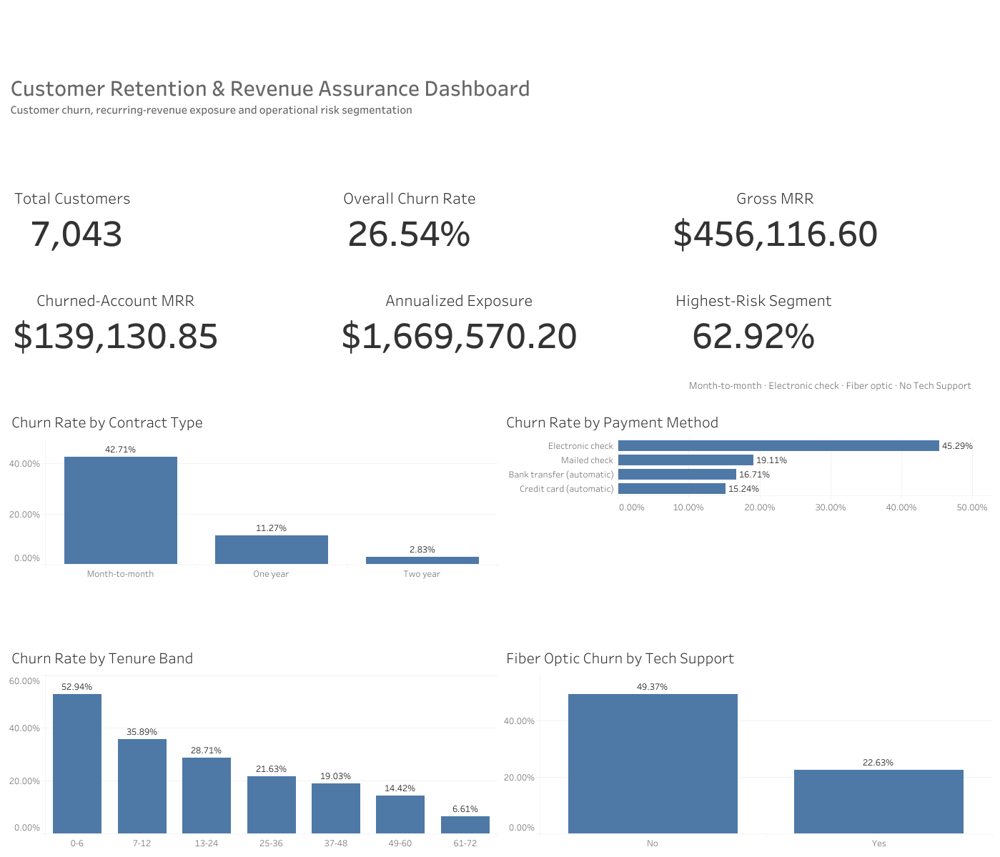

# Customer Retention & Revenue Assurance Audit

> Business Operations & Data Analytics Case Study

A complete end-to-end business analytics project focused on customer churn, revenue leakage and operational decision-making using the IBM Telco Customer Churn dataset.

---

## Executive Summary

Customer retention has a direct impact on recurring revenue and long-term profitability.

This case study investigates the operational drivers behind customer churn across a telecommunications customer base of **7,043 subscribers**. Using SQL, Excel and Tableau, the project identifies the customer segments generating the highest revenue leakage and proposes practical business recommendations to improve retention.

Rather than focusing only on descriptive statistics, this project translates analytical findings into actionable operational decisions.

---

# Business Objectives

This project answers five key business questions:

- Which customer segments churn the most?
- Which operational factors are associated with churn?
- How much monthly recurring revenue is being lost?
- Which customer segments should be prioritized?
- Which business actions deliver the highest operational impact?

---

# Executive KPIs

| KPI | Value |
|------|--------:|
| Customers Analysed | 7,043 |
| Churned Customers | 1,869 |
| Overall Churn Rate | 26.54% |
| Monthly Recurring Revenue | $456,116.60 |
| Monthly Revenue Lost | $139,130.85 |

---

# Interactive Tableau Dashboard

[](https://public.tableau.com/app/profile/rayan.braccio/viz/CustomerRetentionRevenueAssuranceDashboard/ExecutiveDashboard)

The interactive Tableau dashboard consolidates the principal retention, revenue-exposure and customer-risk metrics used throughout the case study.

[View the interactive dashboard on Tableau Public](https://public.tableau.com/app/profile/rayan.braccio/viz/CustomerRetentionRevenueAssuranceDashboard/ExecutiveDashboard)

---

# Project Workflow

Raw Dataset

↓

Data Cleaning

↓

SQL Validation

↓

Exploratory Data Analysis

↓

Business Insights

↓

Financial Impact Assessment

↓

Operational Recommendations

↓

Executive Report

---

# Technology Stack

- SQL
- Microsoft Excel
- Tableau
- Google Sheets
- Google Docs
- Business Analytics
- Data Cleaning
- Data Visualization
- KPI Reporting
- Revenue Analysis

---

# Key Insights

## 1. Contract Structure

Customers on month-to-month contracts represent the largest concentration of churn.

- Churn Rate: **42.71%**
- Contribution to Total Churn: **88.55%**

---

## 2. Payment Behaviour

Electronic Check customers present the highest churn probability.

This payment method alone generates the largest concentration of monthly revenue leakage.

---

## 3. Customer Support

Fiber Optic customers without Technical Support exhibit significantly higher churn than customers receiving onboarding assistance.

This suggests that operational support has a measurable impact on customer retention.

---

# Business Recommendations

| Recommendation | Priority |
|---------------|----------|
| Promote annual contracts through CRM automation | High |
| Increase AutoPay adoption | High |
| Introduce structured Fiber onboarding | Medium |

---

# Business Impact

The project estimates that reducing churn by only **3%** could protect approximately **$50,000** of annual recurring revenue, while a **5% reduction** could generate more than **$83,000** in annual revenue recovery.

---

# Repository Structure

```text
customer-retention-revenue-assurance-audit/
├── README.md
├── Case_Study_01_Customer_Churn_Analysis.pdf
├── MANIFEST.json
├── dashboard/
│   ├── README.md
│   └── dashboard_preview.png
├── data/
│   ├── raw/
│   │   └── WA_Fn-UseC_-Telco-Customer-Churn.csv
│   └── processed/
│       └── telco_customer_churn_clean.csv
├── docs/
│   ├── DATA_PACKAGE_README.md
│   ├── CLEANING_DOCUMENTATION.md
│   ├── QA_RECONCILIATION.md
│   └── data_dictionary.csv
├── scripts/
│   └── build_clean_dataset.py
└── sql/
    ├── README.md
    ├── 01_data_quality_validation.sql
    ├── 02_executive_kpis.sql
    ├── 03_churn_segmentation.sql
    └── 04_priority_segment_and_revenue.sql
```
# Data and Documentation

- [Source dataset](data/raw/WA_Fn-UseC_-Telco-Customer-Churn.csv)
- [Analysis-ready cleaned dataset](data/processed/telco_customer_churn_clean.csv)
- [Data dictionary](docs/data_dictionary.csv)
- [Data cleaning documentation](docs/CLEANING_DOCUMENTATION.md)
- [QA and KPI reconciliation](docs/QA_RECONCILIATION.md)
- [Dataset package overview](docs/DATA_PACKAGE_README.md)
- [Dataset build script](scripts/build_clean_dataset.py)
- [Verified SQL analysis package](sql/README.md)
- [Dataset manifest](MANIFEST.json)
- [Interactive Tableau dashboard](https://public.tableau.com/app/profile/rayan.braccio/viz/CustomerRetentionRevenueAssuranceDashboard/ExecutiveDashboard)
- [Dashboard documentation](dashboard/README.md)

# Reproducibility

The cleaned dataset can be rebuilt from the original source file using Python:

```bash
python scripts/build_clean_dataset.py \
  --input data/raw/WA_Fn-UseC_-Telco-Customer-Churn.csv \
  --output data/processed/telco_customer_churn_clean.csv
```
The build script validates the source schema, customer ID uniqueness, missing-value treatment, analytical fields and the principal KPIs used in the case study.

---

# Skills Demonstrated

- Business Operations
- Business Analytics
- SQL
- Data Cleaning
- Data Validation
- Exploratory Data Analysis
- Revenue Analysis
- Dashboard Design
- Executive Reporting
- Data Storytelling
- Business Recommendations
- Stakeholder Communication

---

# About the Author

**Rayan Braccio**

Business Operations & Data Analytics professional with experience supporting large-scale platform operations.

Following several years in Trust & Safety Operations, this portfolio showcases the transition toward Business Operations, Business Analytics and Data Analytics by combining operational expertise with structured, data-driven decision making.

---

## Portfolio

This repository is part of a growing Business Analytics portfolio.

Upcoming case studies will include:

- Sales Performance Analytics
- Product Operations Dashboard
- Marketing Campaign Performance
- Fraud & Risk Analytics
- Supply Chain Analytics

---

If you found this project interesting, feel free to connect with me on LinkedIn.
